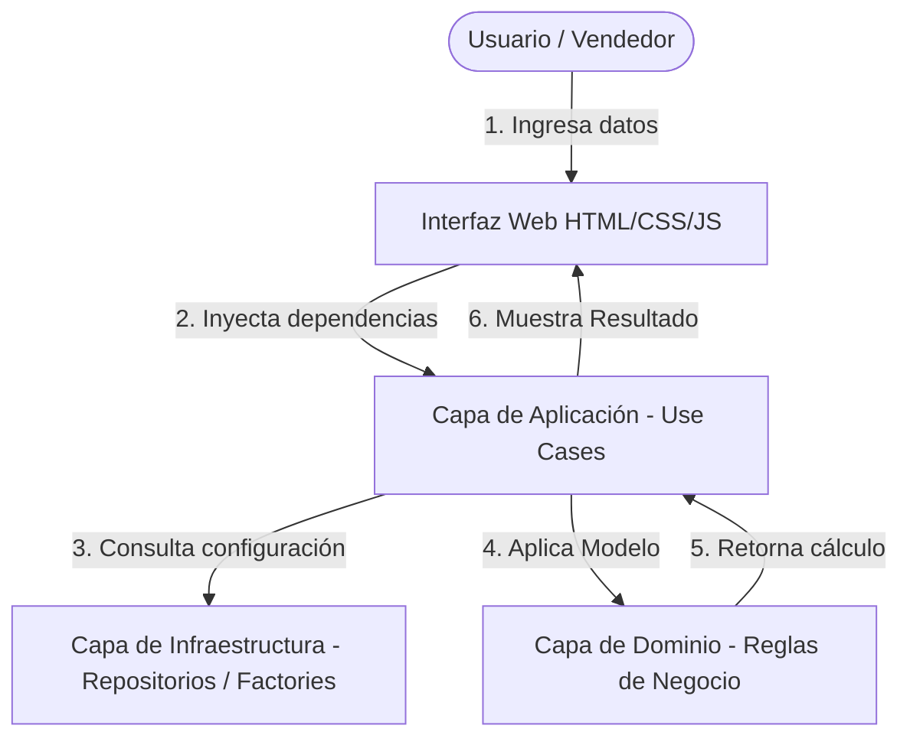
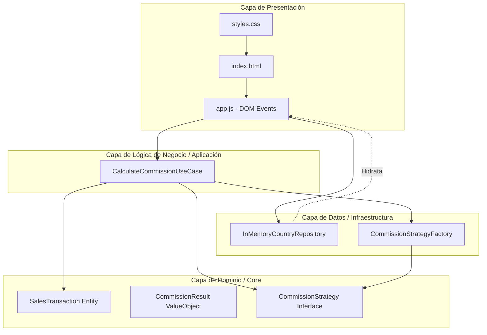
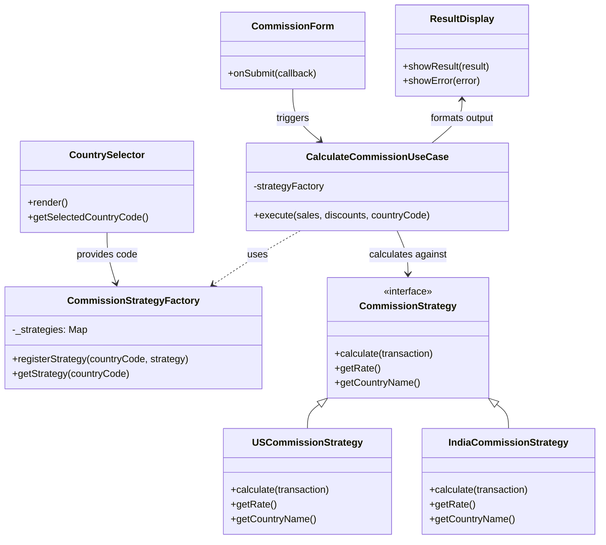

# Diseño Arquitectónico: Calculadora de Comisiones

Este documento contiene los diagramas formales de arquitectura de la aplicación, elaborados para cumplir con los criterios de evaluación.

## 1. Diagrama de Diseño de la Solución (Visión General)
Ilustra cómo interactúa el usuario con la interfaz y cómo fluye la petición hasta el modelo de dominio.

## 2. Diagrama en Capas (Presentación, Lógica, Datos)
Basado en *Clean Architecture*, garantiza que las dependencias apunten de afuera hacia adentro.

## 3. Diagrama de Componentes (Módulos principales y sus interacciones)
Desglose estricto a nivel de clases y objetos de JavaScript para evidenciar los principios SOLID.

